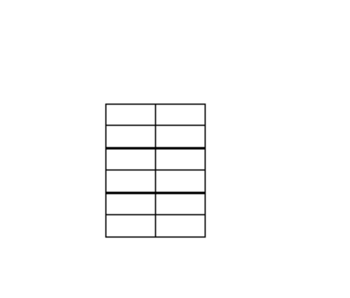
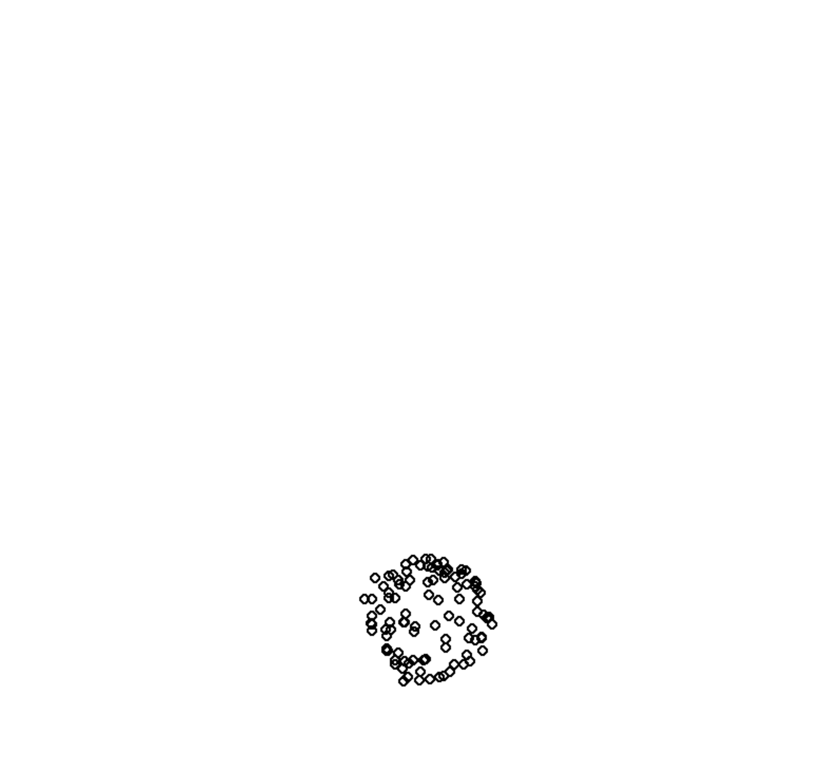
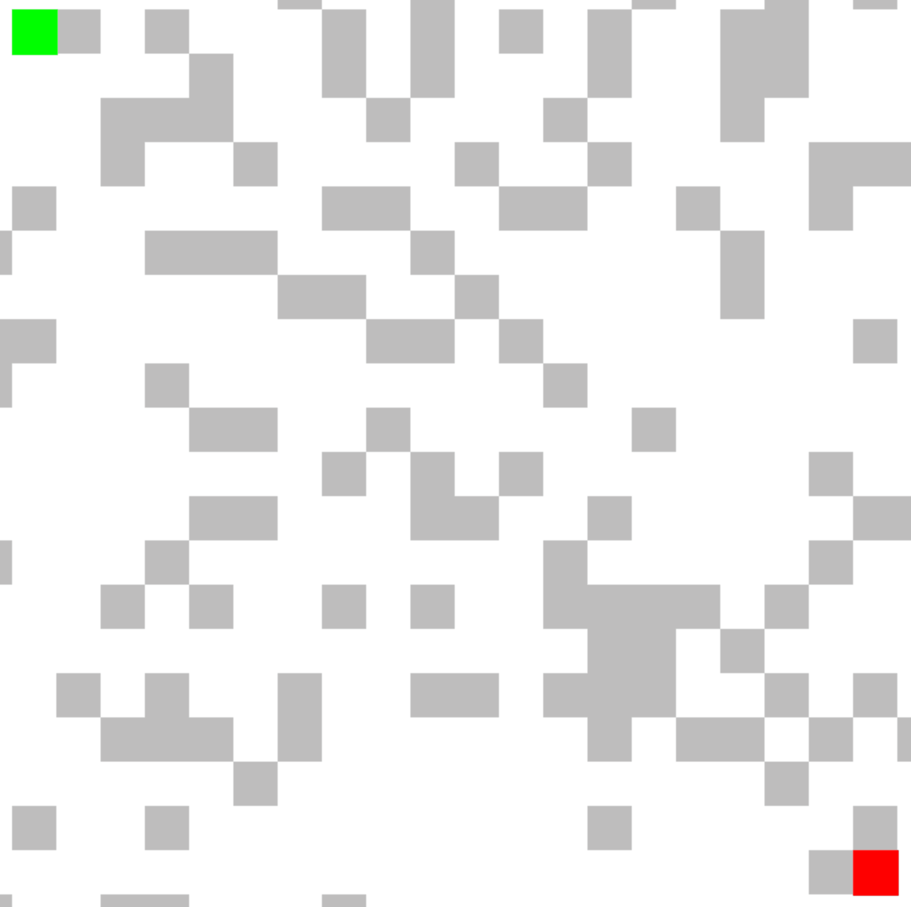

## Simulations
### Cube Simulation:
A basic 3D renderer (v1)  
Status: Seems to actually be working!  

    
Controls

    

        &emsp;To run: python 2022/Fall/Simulations/cube_sim/cube_sim.py 
        &emsp;In GUI: 
        <ul><ul>
            <li>Space - Enter cube</li>
            <li>Shift/Ctrl - Layer up/down</li>
            <li>Escape - Exit GUI to simulation</li>
        </ul></ul>In simulation:<ul><ul>
            <li>Up/Down - Rotate static x</li>
            <li>Right/Left - Rotate dynamic y</li>
        </ul></ul>
    

### Collision Simulation:
Simulates a bunch of colliding spheres  
Status: Buggy but functional (has problems with offsetting at certain gravity values, no GUI, ...)  

    
Controls

    

        To run: python 2022/Fall/Simulations/collision_sim.py 
        In simulation:<ul>
            <li>0-9 controls gravity value (0-0.9 sg's)</li>
        </ul>
    

### Pathfinders:
Simulates one of three different pathfinding algorithms  
Status: Non-optimized but functional
Run: python 2022/Fall/Simulations/pathfinders.py  

    
Controls

    

        To run: python 2022/Fall/Simulations/collision_sim.py
    

