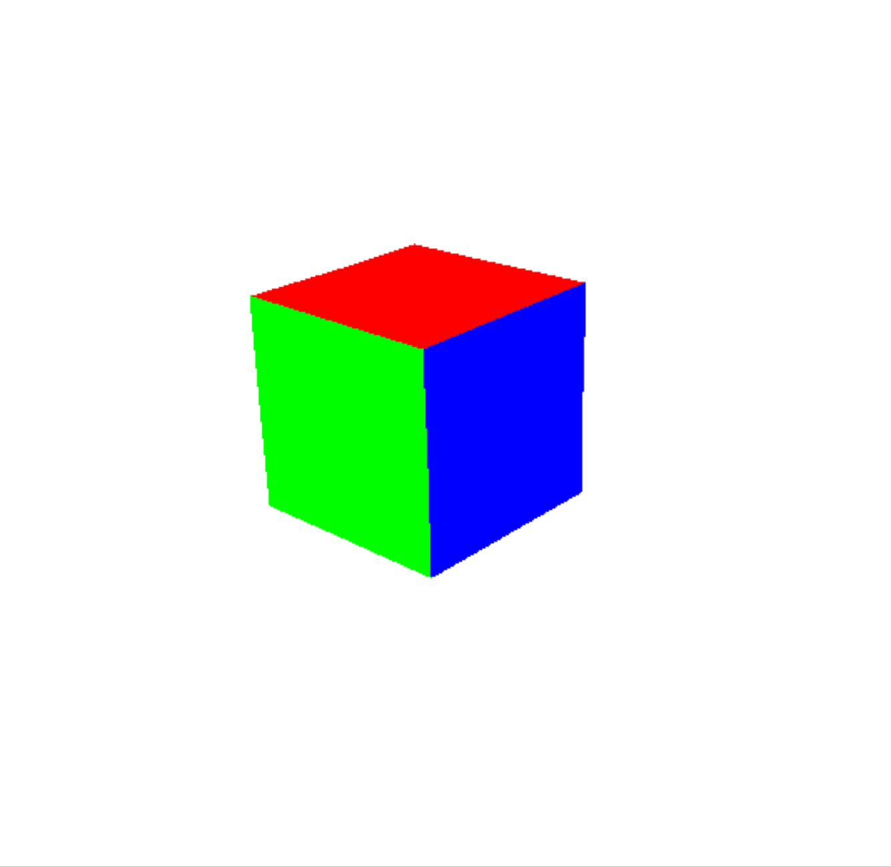

## Simulations
### Boids:
My implementation of boids (https://en.wikipedia.org/wiki/Boids)  
Status: Functional with one major bug (atan calculation is off -> why they sort of peel from the flock when facing at certain angles)

    
Controls

    

        &emsp;To run: python 2023/Spring/Simulations/boids/main.py 
        &emsp;In simulation:<ul><ul>
            <li>N - Add a single boid per tick</li>
            <li>M - Add a chunk of boids per tick</li>
        </ul></ul>
    

### Renderer:
A slightly better 3D renderer with a placement GUI (v2)  
Status: Functional with a few bugs (movement normalization, occlusion clipping)

    
Controls

    

        &emsp;To run: python 2023/Spring/Simulations/renderer/main.py 
        &emsp;In GUI:<ul><ul>
            <li>RClick - Enter cube</li>
            <li>LClick - Remove cube</li>
            <li>Shift/Ctrl - Layer up/down</li>
            <li>Escape - Exit GUI to simulation</li>
        &emsp;</ul></ul>In simulation:<ul><ul>
            <li>Up/Down - Rotate dynamic x</li>
            <li>Right/Left - Rotate dynamic z</li>
            <li>W/S - Move forward/backward</li>
            <li>A/D - Rotate perspective around the orgin?</li>
        </ul></ul>
    

<h2>&emsp;</h2>